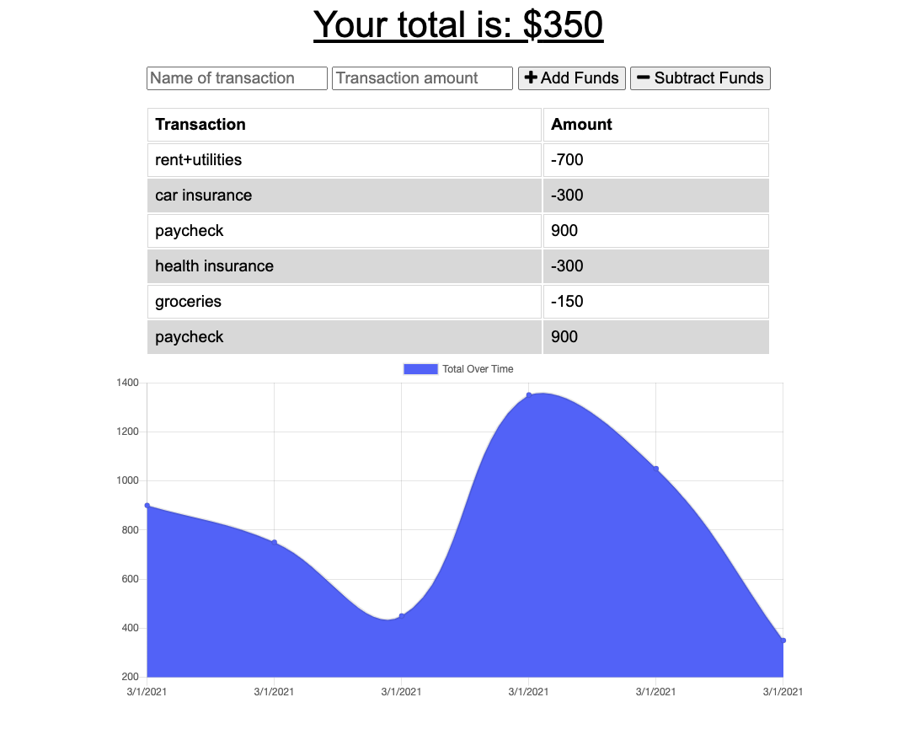
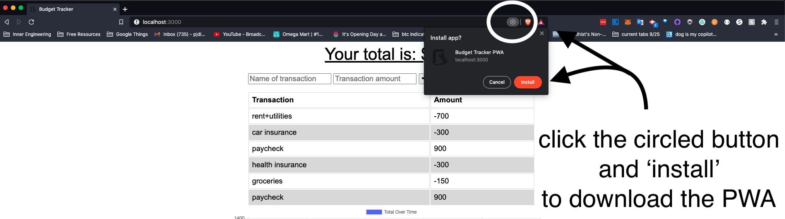

# Philip-DiPaula-OSU-bootcamp-hwk18-PWA-Budget-Tracker

## These are the files for the homework assignment associated with section 18 of the OSU Web Development Bootcamp

* Here is a link to the [github](https://github.com/pjdip/Philip-DiPaula-OSU-bootcamp-hwk18-PWA-Budget-Tracker)
* Here is a link to the deployed application on [heroku](https://mighty-savannah-32837.herokuapp.com/)

The goal of this assignment was to build an MVC application for budget tracking with offline access and functionality. Using service workers, I was able to store budget entries in indexedDB, in order to update the [mongodb](https://www.mongodb.com/) database when online activity resumed.

* [Installation](#installation)
* [Usage](#usage)
* [Credits](#credits)
* [Badges](#badges)
* [License](#license)

## Installation

Installation requirements include node.js, mongodb, and various npm packages.
You will need to install [node](https://nodejs.org/en/download/) and [mongodb](https://docs.mongodb.com/manual/installation/) on your own. Once the repo is cloned, run npm install from the root directory in order to install required npm packages. In order for offline activity to be successful, you will have to allow service workers to access the cache in the browser. If you choose to clone the repo and access the app through your localhost, remember to run the 'mongod' command in a separate terminal from the terminal in which you spin up the server file.

## Usage 

In order to use this application, you can either access it through the heroku link, or clone the repo to your local machine. Then use the command line to navigate to the main folder containing server.js. Once you have MongoDB installed, you should be able to start the server using the command 'node server.js'. If you are successful, there will be a console.log statement alerting you that the app is running on port 3000. If you have any troubles running the application, try doing 'npm install' from the main folder and then try again.

Once you have the server running, if you go to your browser and head to the address "http://localhost:3000/" you should be presented with the home page of the app. From the outset, you will start with an empty budget. Here you can add and subtract funds using the respective buttons. Include a name and quantity for each transaction before submitting. The change over time will be charted in the graph. If you go offline, you can still add/subtract transactions to/from your budget. When the app reconnects to the server, it will update the database and display all edits.

Here are some screenshots:

Main Page: 

Download: 

## Credits

Super Special Thanks to Mozilla Developer Network (MDN) documentation on a variety of topics:
* [webmanifests](https://developer.mozilla.org/en-US/docs/Web/Manifest)
* [using service workers](https://developer.mozilla.org/en-US/docs/Web/API/Service_Worker_API/Using_Service_Workers)
* [offline service workers](https://developer.mozilla.org/en-US/docs/Web/Progressive_web_apps/Offline_Service_workers)
* [service worker install](https://developer.mozilla.org/en-US/docs/Web/API/InstallEvent)
* [service worker fetch](https://developer.mozilla.org/en-US/docs/Web/API/FetchEvent)
* [caches](https://developer.mozilla.org/en-US/docs/Web/API/Cache)
* [using indexedDB](https://developer.mozilla.org/en-US/docs/Web/API/IndexedDB_API/Using_IndexedDB)
* [indexedDB objectStore](https://developer.mozilla.org/en-US/docs/Web/API/IDBObjectStore)
* [fetch](https://developer.mozilla.org/en-US/docs/Web/API/Fetch_API/Using_Fetch)

Special Thanks to [ChilledCow](https://www.youtube.com/channel/UCSJ4gkVC6NrvII8umztf0Ow) for providing chill lofi beats to code to

## Badges

## License

Licensed under the [GNU General Public License v3.0](https://choosealicense.com/licenses/gpl-3.0/)

---